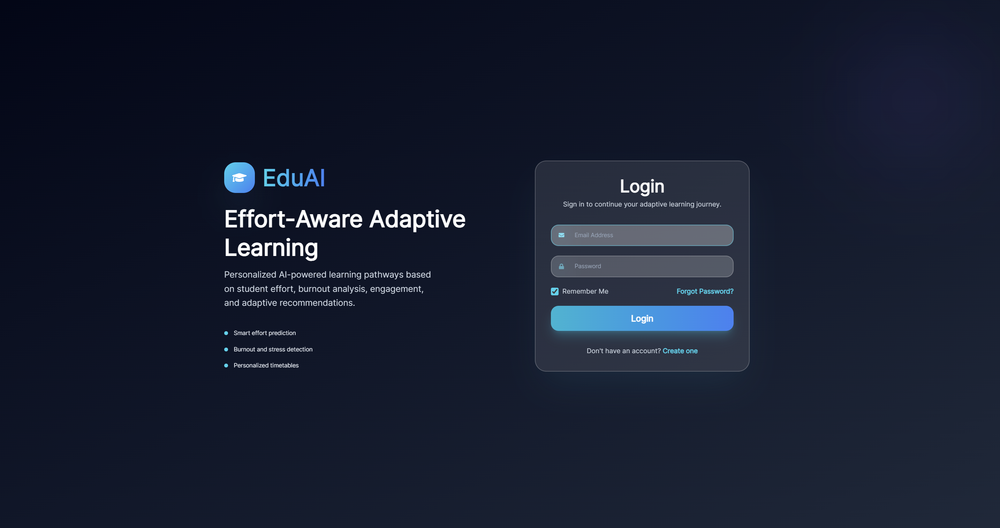
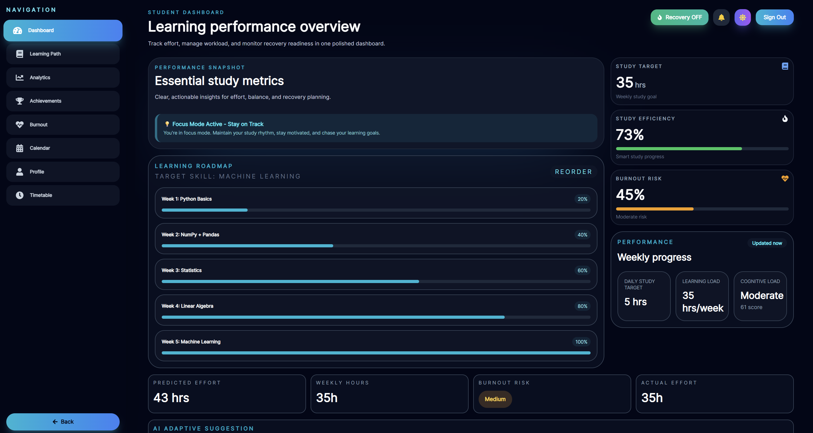
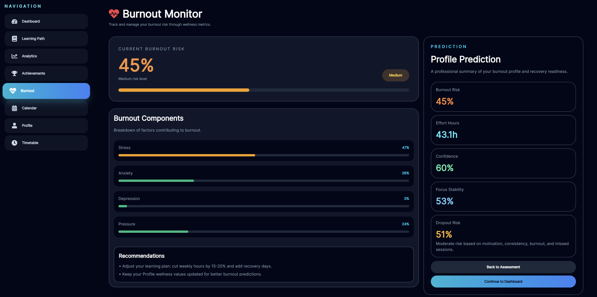
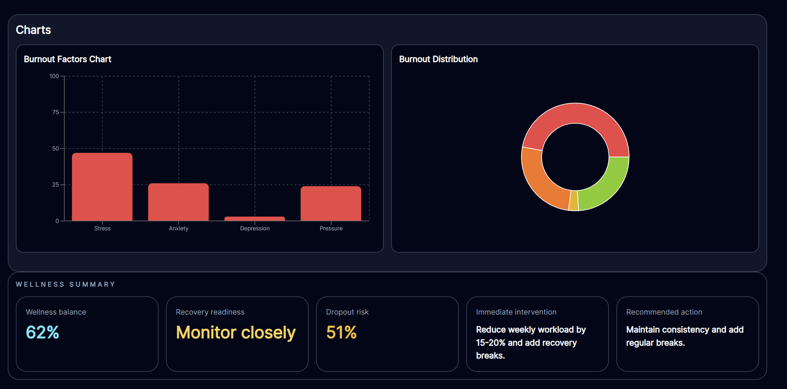
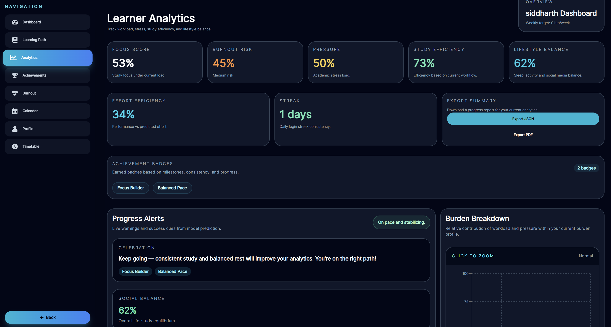
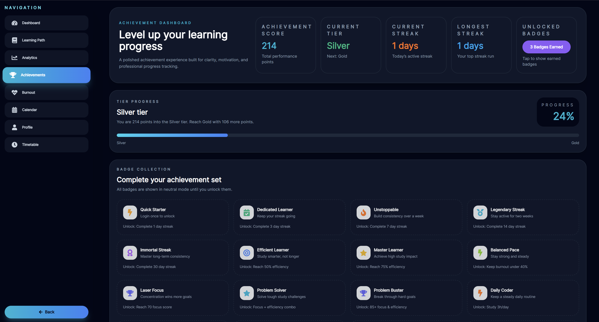

# Effort-Aware Adaptive Learning System


---

## Problem Statement

Learners often abandon upskilling programs due to unrealistic learning timelines, excessive workload, and poorly sequenced learning resources that ignore individual effort and cognitive difficulty.

This project addresses the problem by building an AI-powered effort-aware adaptive learning system that predicts study effort, monitors burnout risk, estimates cognitive load, and generates personalized learning roadmaps.

## Project Summary

Effort-Aware Adaptive Learning System is a modern student productivity platform that helps learners organize study planning, prevent burnout, and improve progress using predictive analytics.

The platform combines:
- a polished React UI with Tailwind CSS
- a Node.js and Express backend for user and profile APIs
- a machine learning workflow for effort estimation and burnout prediction
- MongoDB for profile persistence and adaptive learning state

## Project Preview

### Login


### Dashboard


### Burnout Monitoring



### Learning Path


## System Architecture



## Key Features

- Personalized onboarding assessment
- AI-based effort estimation
- Burnout risk prediction and recovery suggestions
- Cognitive load analysis
- Adaptive learning roadmap generation
- Skill-based study planning
- Dynamic dashboard analytics
- Weekly effort and workload tracking
- Streak and achievement system
- Secure authentication and profile management

## Technology Stack

| Layer | Technology |
|--------|------------|
| Frontend | React.js, Vite, Tailwind CSS |
| Backend | Node.js, Express.js |
| ML Service | Python, FastAPI, scikit-learn |
| Database | MongoDB |
| Authentication | JWT |
| APIs | REST API |
| Tools | VS Code, Postman, Jupyter Notebook |

## Machine Learning Workflow

1. User completes onboarding assessment.
2. Behavioral and wellness features are processed.
3. ML models predict:
   - Required effort hours
   - Burnout risk
   - Cognitive load
4. Adaptive learning roadmap is generated.
5. Dashboard visualizes predictions and recommendations.

## Quick Setup

### Backend

```bash
cd backend
npm install
```

Create `backend/.env` with:

```env
MONGODB_URI=mongodb://localhost:27017/eaals
PORT=5000
```

Launch the backend:

```bash
node index.js
```

### Frontend

```bash
cd frontend
npm install
npm run dev
```

Open the app in your browser at `http://localhost:5173`.

## Usage Workflow

1. Sign up with name, email, and password.
2. Complete onboarding to capture study, wellness, and schedule data.
3. Review personalized dashboard metrics and predictions.
4. Track streaks, achievements, and recovery suggestions.
5. Use the learning path and timetable pages to plan progress.

## Routes and Pages

- `/` — Login
- `/signup` — Signup
- `/onboarding` — Initial assessment
- `/dashboard` — Main dashboard
- `/analytics` — Performance analytics
- `/achievements` — Badges and streak tracking
- `/learning-path` — Adaptive learning plan
- `/timetable` — Daily schedule planner
- `/profile` — Profile management

## API Endpoints

| Method | Endpoint | Description |
|---|---|---|
| POST | `/api/register` | Register a new user |
| POST | `/api/login` | Authenticate user |
| PUT | `/api/profile` | Update user profile and onboarding data |
| POST | `/api/predict` | Generate prediction results |

## Professional Notes

- Users who complete onboarding are redirected to the dashboard.
- Login streak data is stored per user in local storage.
- The backend supports profile updates and predictive analytics for improved learning suggestions.

## Future Enhancements

- AI mentor / chatbot guidance
- Smart resource recommendation engine
- Dynamic roadmap re-planning
- Skill dependency graph
- Dropout risk prediction
- Real-time productivity analytics
- Cloud deployment support

## License

This project is licensed under the MIT License.

---

## Notes for Reviewers

Highlight the adaptive learning workflow, burnout prediction, and the combination of frontend, backend, and ML services. This repo is designed to show both a polished student dashboard and an intelligent recommendation engine.
